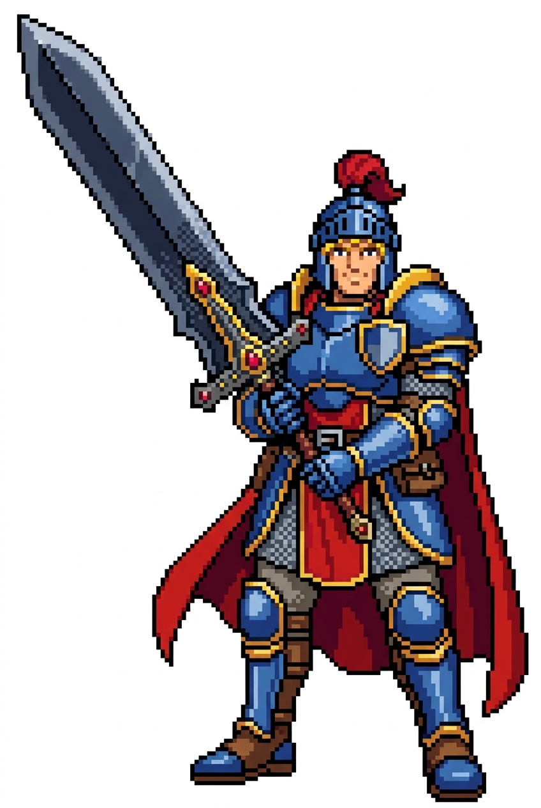
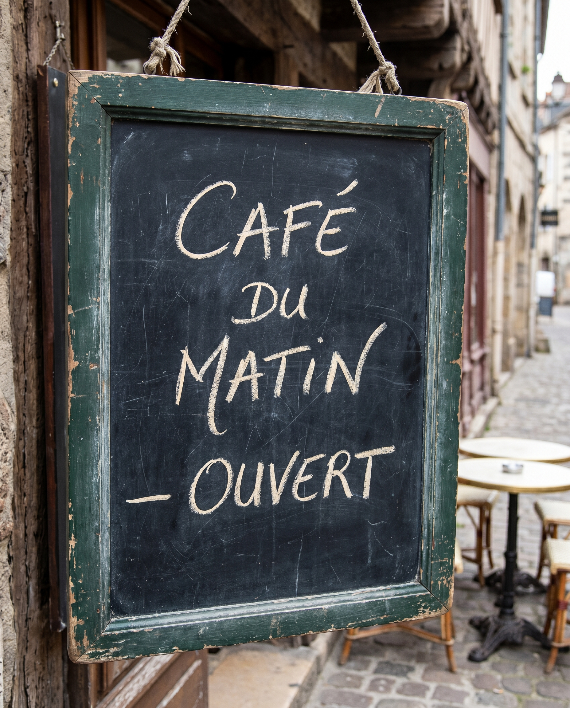
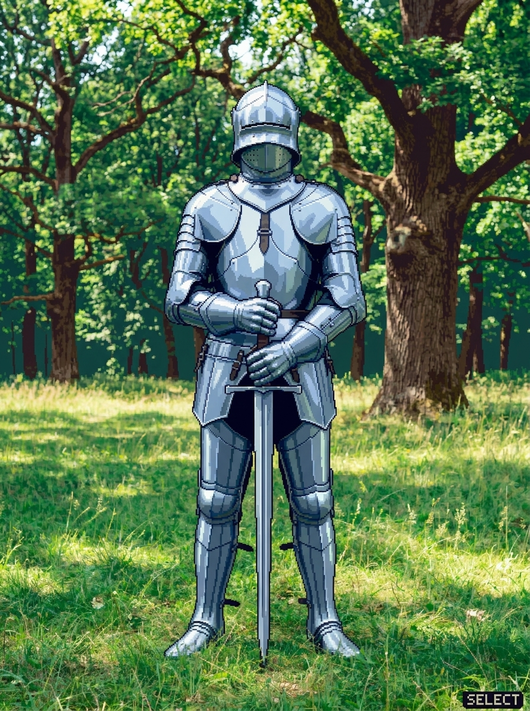
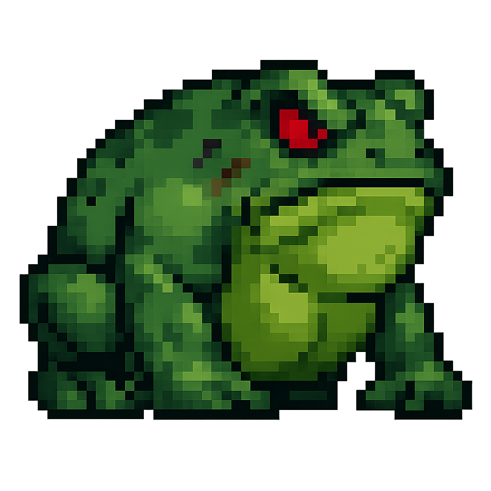
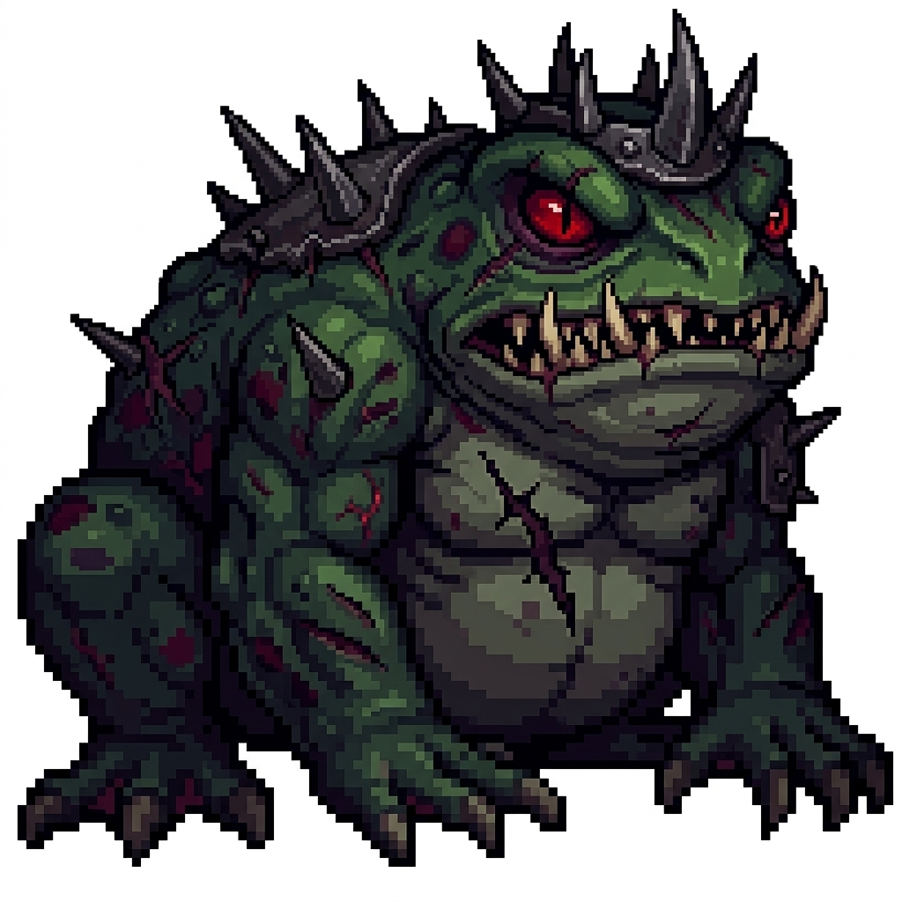

# nanogen

> A zero-dependency Node.js CLI + Claude-Code skill for image generation
> and editing via Google's Nano Banana (Gemini image models).


<sub>Generated with: `nanogen --model gemini-3-pro-image-preview --size 2K --aspect 16:9 --style digital-painting-concept ...`</sub>

`nanogen` wraps the Gemini image-generation API behind a small, strict
CLI and surfaces it as a `/nanogen` skill inside Claude Code. It does
text-to-image, multi-image edits, natural-language region guidance,
and multi-turn iterative editing with verbatim `thoughtSignature`
round-tripping (the load-bearing correctness property for Gemini 3
continuation). 72 built-in style presets across 10 categories. No npm
install, no SDK — just `fetch` and Node built-ins.

---

## Features

- **Text-to-image** with 72 style presets, 14 aspect ratios, 4 sizes,
  seed/temperature, thinking-level control.
- **Multi-image edits** — up to 14 reference images per call, natural-
  language `--region` guidance (no bitmap masks), style transfer,
  object replacement, background replacement.
- **Multi-turn continuation** via `--history-continue` with byte-
  identical `thoughtSignature` round-trip — works around the Gemini
  3 gotcha where a missing or mangled signature returns HTTP 400.
- **History** is an append-only JSONL file with a tolerant reader;
  SHA-tagged ids guard against collisions across paths that slugify
  the same way.
- **Refusal detection** on all 8 documented Gemini paths (`SAFETY`,
  `PROHIBITED_CONTENT`, `IMAGE_SAFETY`, `RECITATION`,
  `soft-refusal:no-image`, prompt-block, `no-candidates`,
  `bad-image-bytes`).
- **Retry with backoff + jitter** on transient HTTP failures;
  immediate fail on auth/region/admin/content-policy errors (no
  wasted retries on terminal states).
- **Two surfaces** — standalone Node CLI (scriptable, CI-friendly)
  or Claude-Code `/nanogen` skill (agent-driven style selection +
  iteration verbs).
- **Zero npm dependencies.** Uses Node 20.12+ built-ins only.
- **171 offline tests** covering every validation code, refusal
  path, retry scenario, env-var edge case, and end-to-end mock-
  server round-trip including `thoughtSignature` preservation.

---

## Gallery

Every image below was generated by this CLI during the repo's
verification pass. Total spend for all 15: about **$0.60** —
mostly Flash 1K at $0.034 each, with Pro 2K hits for the scene
and the text-in-image shot.

### Text-to-image

 

Left: **Flash 1K, `--aspect 1:1`** from `"a single red apple on a white marble table"`.
Right: **Flash 1K, `--aspect 2:3 --style pixel-16bit`** — `/nanogen` skill-expanded from the user input *"a 16-bit warrior with a huge sword on a white background."*

### The 72-preset style catalog — same subject, three styles

The catalog is data, not templates: each entry contributes a
natural-language style fragment. Here's the same lighthouse prompt
across three genuinely different styles — `watercolor` (painterly),
`cyanotype` (photographic), and `art-deco` (fine-art-historical):

| `--style watercolor` | `--style cyanotype` | `--style art-deco` |
|:---:|:---:|:---:|
|  |  |  |

All three: **Flash 1K, `--aspect 4:5`**, same prompt —
`"a solitary stone lighthouse on a rocky point, crashing waves at its base, an overcast sky, a single gull overhead"`.

List every slug:
```bash
node -e 'require("./.claude/skills/nanogen/styles.json").forEach(s => console.log(s.category.padEnd(22), s.slug))'
```

### Text rendered inside images (Pro + `--thinking high`)

Readable text-in-image is historically a weak spot for diffusion
models. Pro at 2K with `--thinking high` gets it right most of the
time:



**Pro 2K, `--aspect 3:4 --thinking high`**.
Prompt (quote the literal string you want rendered):
`"a vintage French coffee-shop chalkboard sign reading exactly 'CAFÉ DU MATIN — OUVERT' in hand-drawn cursive chalk lettering..."`

### Edit mode — region-based inpainting

`--image` + `--region "<description>"` changes part of an existing
image via natural language. No bitmap mask needed.

| Before | After |
|:---:|:---:|
|  |  |

**`--image apple.jpg --region "change the apple to bright green"`** — Flash 1K, $0.034.

### Edit mode — object replacement

Same mechanism, bigger transform. Pose, composition, armor preserved.

| Before | After |
|:---:|:---:|
|  |  |

**`--image knight.jpg --region "replace the sword with a heavy battle axe, same pose and hand position"`** — Flash 1K, $0.034.

### Edit mode — style transfer

`--image` + `--prompt` + `--style` together. The composition is
preserved; the aesthetic is rewritten.

| Before (photorealistic) | After (`--style pixel-16bit`) |
|:---:|:---:|
|  |  |

**`--image knight.jpg --prompt "convert this to 16-bit SNES-era pixel art while preserving composition, pose, and key elements" --style pixel-16bit`** — Flash 1K, $0.034.

### Edit mode — amplify a user asset

The frog on the left is a user-supplied input sprite (not
AI-generated). The frog on the right is what `/nanogen` produced
when asked for *"an even bigger/meaner version of
frog_large_boss.png"*:

| Input (user asset) | Amplified |
|:---:|:---:|
|  |  |

**`--image frog-boss.png --prompt "transform this frog boss into an even bigger and meaner version..."`** — Flash 1K, $0.034.

### Multi-image composition (two `--image` inputs → one output)

Give Gemini N reference images (up to **14**) and it composites
them into one scene. First `--image` is treated as the primary
reference; later ones contribute style, palette, or specific
objects.

| Input A (knight) | Input B (apple) | Composite |
|:---:|:---:|:---:|
|  |  |  |

**`--image knight.jpg --image apple.jpg --prompt "knight triumphantly holding the red apple overhead..."`** — Flash 1K, $0.034.

### Multi-turn continuation — iterative refinement

Each step uses `--history-continue <id>` which round-trips the
prior turn's `thoughtSignature`. The model keeps context of what
it just produced and refines in-place rather than regenerating
from scratch.

| Turn 1 — generate | Turn 2 — `--region` edit | Turn 3 — `--history-continue` |
|:---:|:---:|:---:|
|  |  |  |

```bash
# Turn 1 — generate; history id becomes "apple-...".
nanogen --prompt "a single red apple on a white marble table" --output apple.jpg

# Turn 2 — edit via --region; history id becomes "apple-green-...".
nanogen --image apple.jpg --region "change the apple to bright green" --output apple-green.jpg

# Turn 3 — continue from turn 2's id, adding detail.
nanogen --history-continue apple-green-<suffix> \
        --prompt "add a stem and leaf" --output apple-green-leaf.jpg
```

Chain continues indefinitely — each `--history-continue` picks up
from the newly-created row.

### Via `/nanogen` in Claude Code (agent-expanded prompts)

Drop the flags and talk to Claude naturally. The agent reads
`SKILL.md`, picks a style from the 72-preset catalog, chooses
asset-type defaults (model, aspect, size), routes output to
`assets/<category>/`, and runs the CLI.


**User typed into Claude Code:** `/nanogen A picture of a cute spider with fuzzy legs and eight eyes. 16-bit. large.`

**What the skill layer produced** (Flash 2K, $0.050, `--style pixel-16bit --aspect 1:1`):
```
A cute spider with fuzzy hairy legs and eight shiny round eyes, friendly
and charming, facing the viewer, centered on a plain background, clean
silhouette. Style: 16-bit pixel art with a 32-to-64 color palette,
crisp square pixels, selective dithering, cel-style character sprites,
saturated yet balanced colors evoking early-1990s cartridge graphics.
```

The agent layer handled: style selection (matched "16-bit" → the
`pixel-16bit` slug), size upgrade ("large" → `--size 2K`),
composition hints (`"centered on a plain background, clean
silhouette"`), and the full prompt expansion from the catalog.

---

## Quickstart

### 1. Requirements

- Node.js **≥ 20.12**
- A Gemini API key (see [API key setup](reports/nanogen-api-key-setup.md))
- Claude Code (if you want the `/nanogen` skill surface; the raw CLI
  works standalone)

### 2. Get a key + set `.env`

```bash
# Visit https://aistudio.google.com/app/apikey → Create API key →
# "Create API key in new project". Copy the key.
echo 'GEMINI_API_KEY=<paste-your-key>' > .env
```

`.env` is already gitignored by this repo.

### 3. Smoke test (no spend)

```bash
node .claude/skills/nanogen/generate.cjs \
  --prompt "test" --output /tmp/t.png --dry-run
```

Should print a JSON line starting with `{"dryRun":true,...`, exit 0.

### 4. First real generation (~$0.034)

```bash
node .claude/skills/nanogen/generate.cjs \
  --prompt "a single red apple on a white marble table" \
  --output apple.png
```

Or, from inside Claude Code:

```text
/nanogen a single red apple on a white marble table
```

The skill reads the 72-preset catalog and infers a reasonable style +
aspect + size; for full control, pass flags: `/nanogen --style
pixel-16bit --aspect 16:9 a knight drawing a sword`.

### 5. Read the full examples

See [`docs/examples.md`](docs/examples.md) for worked examples of
every feature — text-to-image, style transfer, object replacement,
multi-image composition, multi-turn continuation, all the flags.

---

## Install into another repo

The `.claude/skills/nanogen/` tree is self-contained. Pick whichever
install route fits — you do NOT need to clone this repo.

### Option 1 — ask your agent

Paste this into Claude Code (or any coding agent) in your target repo:

> Install the nanogen skill from github.com/zeveck/nanogen into
> `.claude/skills/nanogen/`. Fetch the files via raw.githubusercontent.com;
> add a Bash permission for `node .../nanogen/generate.cjs:*` to
> `.claude/settings.local.json`; set `.claude/zskills-config.json`
> `testing.unit_cmd` to `"cd .claude/skills/nanogen && npm test"`.

The agent can handle it from there.

### Option 2 — `curl` the files you need (no clone)

Fetches ~0.8 MB of actual skill content. No gallery, no plans, no
reports. Target directory is empty when you start.

```bash
cd your-repo-root
mkdir -p .claude/skills/nanogen/tests/fixtures

BASE=https://raw.githubusercontent.com/zeveck/nanogen/main/.claude/skills/nanogen

# Core files
for f in generate.cjs magicBytes.cjs styles.json SKILL.md reference.md README.md package.json; do
  curl -sSL "$BASE/$f" -o ".claude/skills/nanogen/$f"
done
chmod +x .claude/skills/nanogen/generate.cjs

# Tests + fixtures (optional but let you verify the install)
for f in test_parse_args test_styles test_request_builder test_response_parser \
         test_http_retry test_env test_history test_integration \
         test_edit_multi_image test_multi_turn test_docs_lint; do
  curl -sSL "$BASE/tests/$f.cjs" -o ".claude/skills/nanogen/tests/$f.cjs"
done
# (fixtures: download the per-test JSON + PNG fixtures the same way,
#  from $BASE/tests/fixtures/, if you want the full test suite to pass)
```

Then add to `.claude/settings.local.json` `permissions.allow`:
```
"Bash(node /abs/path/to/your/repo/.claude/skills/nanogen/generate.cjs:*)"
```

Smoke test:
```bash
node .claude/skills/nanogen/generate.cjs --help
```

### Option 3 — sparse-checkout clone (git-tracked, lean)

Clones only the skill directory; follows updates via `git pull`.
Same ~0.8 MB on disk, but the checkout is a real git repo so you
can track upstream changes.

```bash
git clone --filter=blob:none --sparse https://github.com/zeveck/nanogen
cd nanogen
git sparse-checkout set .claude/skills/nanogen
# Move the skill dir where you want it, or reference it in place.
```

### Option 4 — full clone (everything)

If you want the plans, reports, gallery, and build source too
(~50 MB on disk, mostly due to the 18 MB image gallery):

```bash
git clone https://github.com/zeveck/nanogen
```

---

### Regardless of install route — final two steps

1. **Get a Gemini API key**, set it in `.env` at your repo root:
   ```bash
   echo 'GEMINI_API_KEY=<paste-your-key>' > .env
   ```
   Full walkthrough: [`reports/nanogen-api-key-setup.md`](reports/nanogen-api-key-setup.md).
2. **Wire up the test command** (optional). Edit
   `.claude/zskills-config.json`:
   ```json
   "testing": { "unit_cmd": "cd .claude/skills/nanogen && npm test", ... }
   ```

---

## Repo layout

```
.
├── README.md                          ← you are here
├── CLAUDE.md                          ← agent conventions for this repo
├── docs/
│   ├── examples.md                    ← worked examples, every feature
│   └── images/                        ← gallery images for this README
│                                        (tracked; the generic assets/
│                                        output dir is gitignored)
├── reports/
│   ├── nanogen-api-key-setup.md       ← zero-to-working API key guide
│   ├── plan-sub-1-cli-core.md         ← phase reports from the build
│   ├── plan-sub-2-edit-flow.md
│   └── plan-sub-3-skill-install.md
├── plans/
│   ├── META_IMPLEMENT_A_NANOGEN_SKILL_SIMI.md
│   ├── SUB_1_CLI_CORE.md              ← CLI + style catalog + tests
│   ├── SUB_2_EDIT_FLOW.md              ← edit flow + multi-turn
│   └── SUB_3_SKILL_INSTALL.md          ← SKILL.md + install + checkpoint
├── build/nanogen/                     ← canonical dev source
│   ├── generate.cjs                   ← the CLI (~2000 lines)
│   ├── styles.json                    ← 72 presets × 10 categories
│   ├── magicBytes.cjs                 ← PNG/JPEG/WEBP magic-byte check
│   ├── SKILL.md                       ← /nanogen skill playbook
│   ├── reference.md                   ← full style catalog + ref docs
│   ├── README.md                      ← CLI-specific docs
│   ├── package.json                   ← test script, engines pin
│   ├── tools/                         ← authoring-only (not installed)
│   │   └── render-style-reference.cjs
│   ├── tests/                         ← 171 offline tests, 11 files
│   │   ├── test_parse_args.cjs        ← arg validation + 21 error codes
│   │   ├── test_styles.cjs            ← catalog validation
│   │   ├── test_request_builder.cjs   ← golden-tested request bodies
│   │   ├── test_response_parser.cjs   ← 8 refusal paths + thoughtSig
│   │   ├── test_http_retry.cjs        ← mock server, retry behaviours
│   │   ├── test_env.cjs               ← env-var + .env walker
│   │   ├── test_history.cjs           ← JSONL append/read/tolerant
│   │   ├── test_edit_multi_image.cjs  ← multi-image + --region
│   │   ├── test_multi_turn.cjs        ← --history-continue
│   │   ├── test_integration.cjs       ← end-to-end mock-server flows
│   │   └── test_docs_lint.cjs         ← doc forbidden-tokens lint
│   └── fixtures/
│       ├── tiny-1x1.png               ← 67-byte canonical PNG
│       ├── request-*.json             ← golden request bodies
│       ├── response-*.json            ← response fixtures (success + 8 refusal paths)
│       └── fixture-history-*.jsonl    ← continuable + edge-case history files
└── .claude/skills/nanogen/             ← installed copy of build/nanogen/
                                         (same tree minus tools/)
```

The canonical source is `build/nanogen/`. `.claude/skills/nanogen/` is
an install artifact — any change should go into `build/nanogen/` first
and then be copied across.

---

## Architecture

### Two surfaces over one engine

```
┌─────────────────────────────────┐     ┌─────────────────────────────┐
│  Claude Code user types         │     │  Raw CLI (scripts, CI)      │
│  /nanogen a cozy cabin …        │     │  node generate.cjs --prompt │
└───────────────┬─────────────────┘     └──────────────┬──────────────┘
                │                                       │
                ▼                                       │
      ┌──────────────────┐                              │
      │  SKILL.md        │                              │
      │  • style picker  │                              │
      │  • asset defaults│                              │
      │  • iter. verbs   │                              │
      └─────────┬────────┘                              │
                │                                       │
                └───────────────────┬───────────────────┘
                                    ▼
                          ┌──────────────────────────┐
                          │  generate.cjs (the CLI)  │
                          │  • parseArgs + 21 rules  │
                          │  • styles.json loader    │
                          │  • pure request builder  │
                          │  • parseResponse         │
                          │  • fetchWithRetry        │
                          │  • history JSONL         │
                          └──────────────┬───────────┘
                                         ▼
                       ┌─────────────────────────────────┐
                       │  generativelanguage.googleapis  │
                       │  .com/v1beta/models/            │
                       │  gemini-3.1-flash-image-preview │
                       │  :generateContent               │
                       └─────────────────────────────────┘
```

### Pure vs I/O split (for testability)

- `readImageMaterials(args)` — I/O layer. Reads every `--image` path
  into a `Buffer` + MIME tag. Small, isolated, testable against fakes.
- `buildGenerateRequestFromMaterials(args, materials, styles)` — pure.
  No filesystem access, no env reads (other than `NANOGEN_API_BASE`).
  Returns `{url, headers, body}`. Golden-testable.
- `parseResponse(json)` — pure. Implements the documented 8-step
  refusal-detection decision tree.
- `fetchWithRetry(url, init)` — I/O layer. Retry ladder, timeout,
  `Retry-After` handling.
- `appendHistory(entry)` / `readHistory()` — I/O layer.
  `appendFileSync`-based, tolerant reader skips malformed lines.

### Continuation body shape (Gemini 3 specific)

```jsonc
{
  "contents": [
    { "role": "user",  "parts": [{ "text": "<prior prompt>" }] },
    {
      "role": "model",
      "parts": [
        {
          "inlineData":       { "mimeType": "image/png", "data": "<b64 of prior output>" },
          "thoughtSignature": "<verbatim sig from prior response>"
        }
      ]
    },
    { "role": "user", "parts": [{ "text": "<current prompt>" }, ...current images] }
  ],
  "generationConfig": { ... }
}
```

`thoughtSignature` MUST be a field on the SAME part as `inlineData`,
not a sibling part. Splitting them returns `HTTP 400: "Image part is
missing a thought_signature in content position 2, part position 1"`
(reproduced live against Flash 3.1, 2026-04-17).

---

## Quick reference

| | |
|---|---|
| **Env var** | `GEMINI_API_KEY` (preferred) or `GOOGLE_API_KEY` (fallback, with stderr warning) |
| **`.env` location** | Repo root — walker finds it from any cwd within the tree |
| **Default model** | `gemini-3.1-flash-image-preview` (~$0.034/image at 1K) |
| **High-quality model** | `gemini-3-pro-image-preview` (~$0.134/image at 2K; needed for legible text-in-image) |
| **Catalog** | 72 presets, 10 categories — list with `node -e 'console.log(require("./.claude/skills/nanogen/styles.json").length)'` |
| **Output history** | `.nanogen-history.jsonl` in cwd (append-only) |
| **Help text** | `node .claude/skills/nanogen/generate.cjs --help` |

Full flag reference:
[`.claude/skills/nanogen/README.md`](.claude/skills/nanogen/README.md).
Full catalog + pricing + every error code:
[`.claude/skills/nanogen/reference.md`](.claude/skills/nanogen/reference.md).
Skill-layer playbook (what Claude reads):
[`.claude/skills/nanogen/SKILL.md`](.claude/skills/nanogen/SKILL.md).

---

## Development

### Working on the CLI

Canonical source is `build/nanogen/`. Edit there, test there, then
mirror to `.claude/skills/nanogen/`:

```bash
cd build/nanogen
# … make changes to generate.cjs, tests, fixtures …
npm test > /tmp/nanogen-test.txt 2>&1   # always capture, don't pipe
grep -E "passed|FAIL" /tmp/nanogen-test.txt

# Copy specific files into the installed location
cp generate.cjs ../../.claude/skills/nanogen/generate.cjs
cp tests/<changed-file> ../../.claude/skills/nanogen/tests/<changed-file>

# Re-run from the installed copy
cd ../../.claude/skills/nanogen
npm test > /tmp/nanogen-installed.txt 2>&1
```

### Authoring the style catalog

`build/nanogen/styles.json` is the source of truth. After editing,
regenerate the catalog section of `reference.md`:

```bash
cd build/nanogen
node tools/render-style-reference.cjs > /tmp/catalog.md
# Paste /tmp/catalog.md into reference.md's "Complete style catalog" section.
```

`tools/` is authoring-only; it's excluded from the install.

### Test philosophy

- **Zero npm deps.** Node built-ins only (`node:assert/strict`,
  `node:child_process`, `node:http`, `node:fs`, `crypto`, etc.).
- **No live API calls.** Tests either (a) dry-run the CLI (no HTTP),
  (b) mock the HTTP layer with an in-process `node:http` server on
  port 0, or (c) pure-function unit tests on the builder/parser.
- **Async `spawn`, not `spawnSync`, when a mock server is involved.**
  `spawnSync` blocks the parent event loop and deadlocks the mock
  server → tests time out with zero `attempts`. See
  `tests/test_integration.cjs` for the `runCLI(...)` helper pattern.
- **Capture, don't pipe.** The project hook blocks piping test
  output (`| tail`, `| head`, `| grep` etc.) because piping loses
  failure details on re-runs. Always
  `npm test > /tmp/results.txt 2>&1` first, then `grep` the file.

### Env vars (production + test-only)

| Var | Scope | Purpose |
|---|---|---|
| `GEMINI_API_KEY` | production | Primary auth key |
| `GOOGLE_API_KEY` | production | Fallback auth (with stderr warning) |
| `NANOGEN_API_BASE` | test-only | Redirect HTTP to mock server |
| `NANOGEN_RETRY_BASE_MS` | test-only | Shrink retry delay (tests use 5ms) |
| `NANOGEN_FETCH_TIMEOUT_MS` | test-only | Short timeout for timeout-path tests |
| `NANOGEN_MAX_RETRIES` | test-only | Set to 0 for fail-fast tests |
| `NANOGEN_DOTENV_PATH` | test-only | Pin `.env` resolution to a specific file (bypasses the walker). Tests use this so tempdir-based tests don't reach the repo's real `.env` via the `__dirname` walk. |
| `NANOGEN_STYLES_PATH` | test-only | Alternate `styles.json` path (for malformed-catalog tests) |

Production users never set the `NANOGEN_*` vars.

---

## Known quirks + limitations

- **Gemini returns JPEG even when you ask for `.png`.** The AI
  Studio endpoint (what this CLI uses) has no parameter to control
  output format — the Gemini docs explicitly omit any
  `outputMimeType` on the image API. Vertex AI's same models DO
  expose `imageConfig.outputMimeType` but switching to Vertex
  requires service-account auth and was ruled out of scope.
  The CLI's response: **write the file at a name that matches the
  actual MIME.** If you pass `--output foo.png` and the API
  returns JPEG, the file on disk is `foo.jpg`, and the success
  JSON reports:
  ```
  {"success":true,"output":"foo.jpg","renamed":{"from":"foo.png","to":"foo.jpg","reason":"..."},...}
  ```
  Plus a stderr warning explaining the rename and how to silence
  it (pass `--output foo.jpg` up front). Any script reading the
  `output` field from the success JSON will Just Work.
- **SynthID watermark.** Every image carries an invisible
  watermark in pixel data; can't be disabled. Light edits preserve
  it; aggressive re-encoding may destroy it. API outputs have no
  visible overlay (only the consumer Gemini app adds one).
- **No bitmap masks.** Use `--region <description>` for
  inpainting-style edits. Gemini resolves region by natural language.
- **No 3+ turn single-invocation chains.** `--history-continue`
  builds a 2-turn conversation (user → model → user). For deeper
  iteration, chain invocations: each `--history-continue` reads the
  prior output + sig.
- **Flash vs Pro for text.** Text rendered inside images is hit-or-
  miss. Best combo: `--model gemini-3-pro-image-preview --size 2K
  --thinking high` + quote the literal string in the prompt. Expect
  1 in 3 to mangle something.
- **Preview models may change schema.** Both default models are
  `-preview`. The response parser logs unknown part shapes to
  `unknownParts[]` instead of crashing, but if Google makes breaking
  changes the parser may need updates.
- **Workspace admin lock.** Enterprise Google accounts can have
  Gemini API disabled by IT. Surfaces as `E_ADMIN_DISABLED`. Use a
  personal Gmail or ask your admin to enable Generative Language API.
- **Regional blocks.** Sanctioned regions return `E_REGION`.

See [`reference.md`](.claude/skills/nanogen/reference.md) §8 for the
full list of live-API gotchas.

---

## Build history

This repo was built end-to-end by an autonomous
[`/research-and-go`](https://github.com/zeveck/zskills) pipeline. The
audit trail is preserved:

- `plans/META_IMPLEMENT_A_NANOGEN_SKILL_SIMI.md` — top-level plan
- `plans/SUB_{1,2,3}_*.md` — the three sub-plans (each drafted with
  adversarial review)
- `reports/plan-sub-{1,2,3}-*.md` — per-phase execution reports
- `reports/nanogen-api-key-setup.md` — the API-key doc + verification
  checklist

The pipeline: decompose the goal → draft 3 sub-plans with adversarial
review → cross-plan consistency review → implement each phase via
dispatched subagents with separate implementation and verification
agents → install into `.claude/skills/nanogen/` as a single atomic
operation → stop at a user-verification checkpoint.

---

## Credits

- Inspired by [zeveck/imagegen](https://github.com/zeveck/imagegen) —
  same two-surface pattern (standalone CLI + Claude skill), same
  zero-dep philosophy. Rewritten from scratch for Google's Nano
  Banana / Gemini image API.
- Uses [Google Gemini API](https://ai.google.dev/gemini-api/docs/image-generation)
  for the image models.
- Built with and for [Claude Code](https://claude.com/claude-code).

---

## License

MIT.
